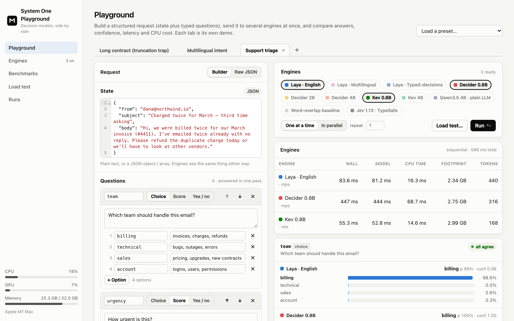
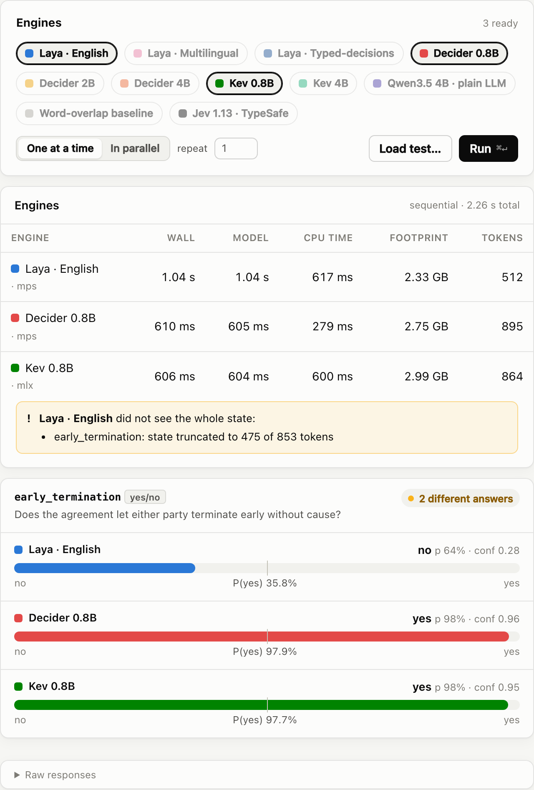
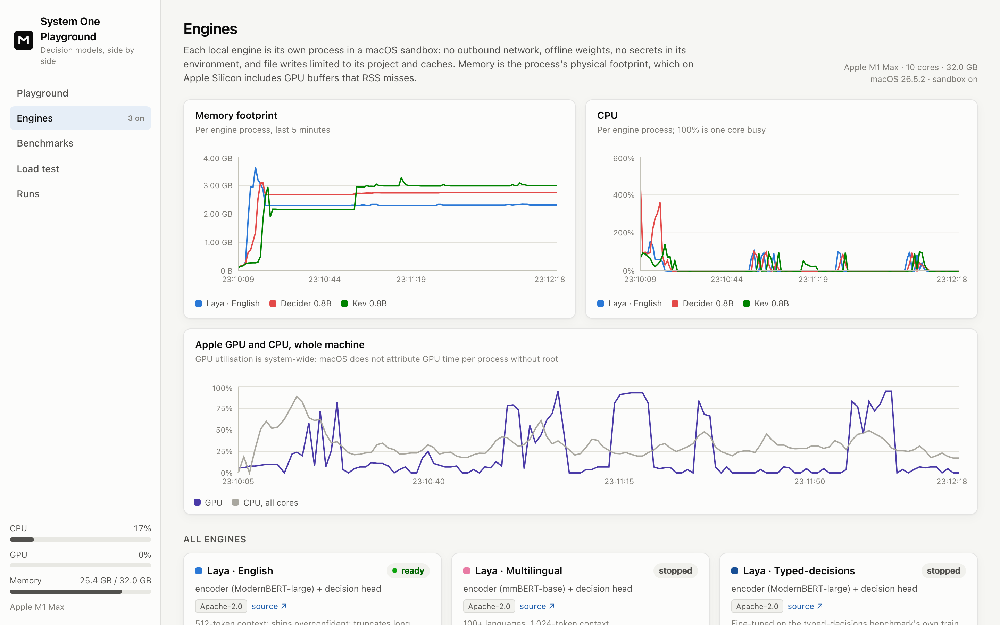
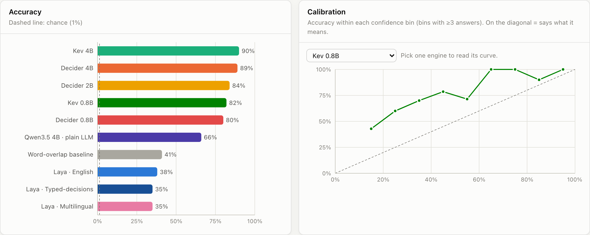
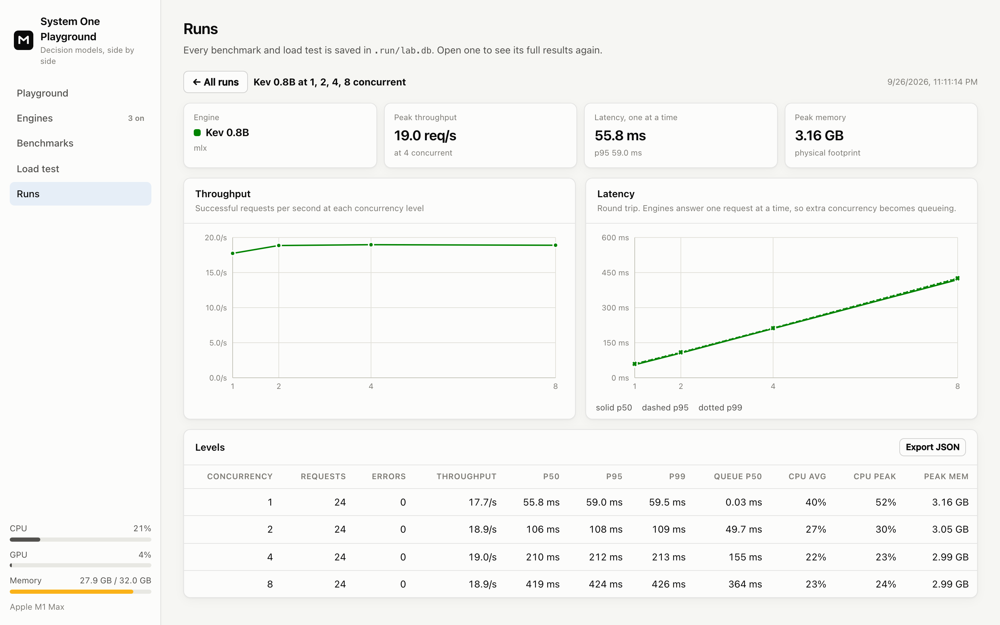
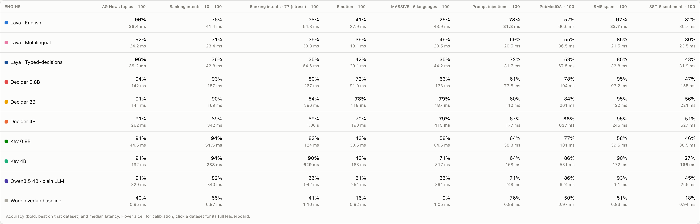
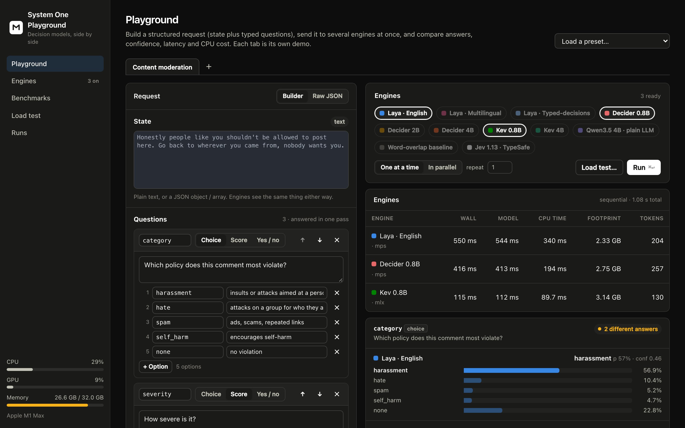
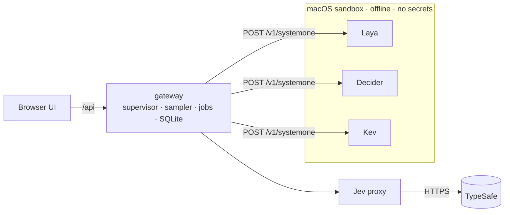

<div align="center">

# System One Playground

**Run the new wave of decision models side by side on your Mac:
[Laya](https://huggingface.co/convaiinnovations/laya), [Decider](https://github.com/Mapika/decider), [Kev](https://github.com/jaredpalmer/kev), and TypeSafe's [Jev](https://docs.typesafe.ai).**
Structured input goes in and calibrated probabilities come out. You get honest numbers for accuracy, calibration, latency, CPU and memory.

[](https://github.com/goodboybeau/system-one-playground/actions/workflows/ci.yml)
[](LICENSE)




</div>

## Quick start

```bash
git clone https://github.com/goodboybeau/system-one-playground
cd system-one-playground
make quickstart
```

That's it:
1. It checks your Mac.
2. It installs everything: one isolated environment per engine, the UI and the datasets.
3. It downloads the three small models (~6 GB).
4. It opens **http://127.0.0.1:8080**.

In the app, start an engine on **Engines**, then press **⌘↵** in the **Playground**.

Requirements: an Apple Silicon Mac, [uv](https://docs.astral.sh/uv/), and Node 20+. `make doctor` tells you what's missing.
For every model (~37 GB): `make weights-all`.

## What's a "System One" model?

A new kind of model that **decides instead of writing**. You send some state and a few typed questions; in a single
forward pass it returns a probability for every option you defined. There's nothing to parse, and it can't answer
outside your schema.

<table>
<tr><th>You send</th><th>You get back (abridged, illustrative numbers)</th></tr>
<tr><td>

```json
{
  "state": {
    "subject": "Charged twice for March",
    "body": "Refund the duplicate or we cancel."
  },
  "questions": {
    "team": {
      "type": "choice",
      "instructions": "Which team?",
      "criteria": {
        "billing": "invoices, refunds",
        "technical": "bugs, outages"
      }
    },
    "urgency": {
      "type": "score",
      "criteria": ["low", "medium", "high"]
    },
    "churn": {
      "type": "noul",
      "instructions": "Threatening to leave?"
    }
  }
}
```

</td><td>

```json
{
  "answers": {
    "team": {
      "choice": "billing",
      "probabilities": {
        "billing": 0.986,
        "technical": 0.014
      },
      "confidence": 0.97
    },
    "urgency": {
      "score": 1.71,
      "level": 2,
      "probabilities": {"0": 0.04, "1": 0.21, "2": 0.75}
    },
    "churn": { "noul": 0.93 }
  },
  "usage": { "input_tokens": 211, "output_tokens": 0 },
  "timing": { "infer_ms": 38.1 }
}
```

</td></tr>
</table>

TypeSafe named the category after Kahneman's fast, intuitive *System 1* when it launched Jev in September 2026. Within
days there were open alternatives. This project runs them on your own machine and measures which ones are actually good.
Background is in [docs/landscape.md](docs/landscape.md).

## What you get

- **🧪 Playground with tabs.**
  - Build requests with a visual question builder or raw JSON, and keep several demos open at once.
  - Pick engines, run, and see every answer's full distribution and whether the engines agree.
  - See latency, CPU time and memory per engine.
  - Ten ready-made presets: support triage, moderation, prompt-injection guardrails, multilingual, agent tool routing, a long-contract truncation trap, and more.
- **📈 Honest resource numbers.**
  - Live CPU, **physical memory footprint** (RSS misses GPU memory on Apple Silicon, by up to 90× in our measurements) and GPU utilisation.
  - Cold start broken into process start, weight loading and kernel warm-up.
- **🏁 Benchmarks.** Nine seeded, deterministic slices of public datasets:
  - accuracy, **calibration** (ECE, Brier, wrong-at-95%, auto-accept-at-95%), reliability curves, accuracy vs latency, confusion matrices, per-language accuracy, and an item explorer for split decisions;
  - benchmark engines whenever they fit in memory, and a leaderboard merges the latest result for each.
- **🚦 Load tests.** Throughput and p50/p95/p99 as concurrency rises, queue time, and CPU and memory under load.
- **🔒 Isolation without Docker.**
  - Every model is its own process in its own virtualenv, inside a macOS sandbox with **no network access**, restricted file writes, and no secrets in its environment.
  - It still gets the Apple GPU (MPS or MLX), which Docker can't give it.
- **🔌 One contract.**
  - Every engine speaks TypeSafe's `/v1/systemone` API, so anything written for Jev works against them.
  - A 12-check conformance suite keeps them honest.
  - Adding a model is one adapter file plus a registry entry.

<table>
<tr>
<td width="50%"><br><sub><b>The truncation trap.</b> Laya only reads the first 475 of 853 tokens and answers wrong; the playground flags it. Decider and Kev read everything.</sub></td>
<td width="50%"><br><sub><b>Engines.</b> Live footprint and CPU per process, GPU for the machine, and cold-start breakdowns.</sub></td>
</tr>
<tr>
<td><br><sub><b>Accuracy and calibration</b> on Banking77's 77 intents. Pick an engine to read its reliability curve.</sub></td>
<td><br><sub><b>Load test.</b> Kev 0.8B saturates at ~19 req/s; beyond that, concurrency is just queueing.</sub></td>
</tr>
<tr>
<td colspan="2"><br><sub><b>Leaderboard across runs.</b> Every engine on every dataset, benchmarked one engine at a time.</sub></td>
</tr>
<tr>
<td colspan="2"><br><sub>Dark mode follows your system.</sub></td>
</tr>
</table>

## Engines

| Engine | What it is | Params | Runs on | Peak memory* |
|---|---|---|---|---|
| **Laya** English, Multilingual, Typed-decisions | Encoder (ModernBERT / mmBERT) + decision head | 421M / 322M / 421M | MPS, CPU | 2.0–3.9 GB |
| **Decider** 0.8B, 2B, 4B | Qwen3.5, fully fine-tuned to read option-letter logits | 0.8–4.2B | MPS | 3.2–3.4 / 5.8–6.8 / 10–13 GB |
| **Kev** 0.8B, 4B | Qwen3.5 base + LoRA + pointer head | 0.9–4.7B | MLX | 2.9–3.5 / 10–17 GB |
| **Qwen3.5 4B · plain LLM** | A stock chat model read the same way: the control | 4.2B | MPS | 11–13 GB |
| **Word-overlap baseline** | Counts shared words; the floor to beat | none | CPU | 40 MB |
| **Jev 1.13** | TypeSafe's hosted model, via a proxy ([needs a key](docs/runbooks/jev.md)) | undisclosed | remote | none |

\*Physical footprint on an M1 Max, measured by the playground.

## Results on an M1 Max (32 GB)

100 items per dataset, one engine at a time, every engine in the sandbox. The table shows accuracy and median latency;
the full numbers, including calibration, are in [docs/landscape.md](docs/landscape.md#local-results-m1-max-32-gb-2026-09-27).

| Engine | Mean over 9 datasets | Banking77 (77-way) | PubMedQA (long input) | Median latency |
|---|---|---|---|---|
| Decider 4B | **80%** | 89% | **88%** | 180–1000 ms |
| Decider 2B | **80%** | 84% | 84% | 110–400 ms |
| Kev 4B | 76% | **90%** | 86% | 160–630 ms |
| Decider 0.8B | 76% | 80% | 78% | 80–270 ms |
| Qwen3.5 4B, plain LLM | 72% | 66% | 86% | 250–940 ms |
| Kev 0.8B | 68% | 82% | 77% | **40–125 ms** |
| Laya English | 60% | 38% | 52% | **30–65 ms** |
| Word-overlap baseline | 40% | 41% | 50% | 1 ms |

What stood out:
- **Decision training beats raw size.** Decider 2B matches Decider 4B on average at half the latency. The plain Qwen LLM trails the same-size decision models by 23 points on Banking77.
- **Laya is fast and narrow.** It gets 96% on news topics and 97% on spam in about 35 ms. It's near chance on fine-grained or long-input tasks, and on Banking77 the word-overlap baseline beats it.
- **Laya silently truncates input past about 475 tokens.** The playground measures exactly how much it cut and warns you.
- **Memory tools lie on Apple Silicon.** Decider 2B shows 0.27 GB of RSS but a 5.6 GB physical footprint.

Run it yourself with `make suite` and [share your chip's results](CONTRIBUTING.md#sharing-benchmark-results).

## How it works



- The **gateway** (FastAPI) spawns each engine, samples its footprint and CPU every 250 ms, runs benchmarks and load tests one at a time, and serves the UI.
- **labkit** turns a ten-line adapter into a contract-checked engine server.
- The **UI** is React, TypeScript and Recharts.

Details are in [docs/architecture.md](docs/architecture.md), and every metric is defined in [docs/metrics.md](docs/metrics.md).

## Commands

| | |
|---|---|
| `make quickstart` | Check, install, fetch the small models, open the app |
| `make lab` | Start the playground on http://127.0.0.1:8080 |
| `make weights-all` | Download every local model (~37 GB) |
| `make suite` | Benchmark every engine on every dataset, unattended |
| `make verify` | Run the contract conformance suite against every engine, in the sandbox |
| `make test` | Unit, integration and browser tests (no weights needed) |
| `make help` | Everything else |

## Docs

- **Runbooks:** [Troubleshooting](docs/runbooks/troubleshooting.md) · [Running benchmarks](docs/runbooks/benchmarking.md) · [Using Jev](docs/runbooks/jev.md)
- **How-tos:** [Add an engine](docs/howto/add-an-engine.md) · [Add a dataset](docs/howto/add-a-dataset.md) · [Add a preset](docs/howto/add-a-preset.md)
- **Reference:** [Architecture](docs/architecture.md) · [Metrics](docs/metrics.md) · [Landscape and research notes](docs/landscape.md) · [Decision Index snapshot](docs/decision-index.md) · [Roadmap](ROADMAP.md)

## FAQ

<details>
<summary><b>Do I need a GPU, Docker, or an API key?</b></summary>

No. Everything runs locally on the Apple GPU through MPS or MLX. Docker isn't used, because it can't reach the Apple GPU on macOS. An API key is only needed for the optional Jev engine.
</details>

<details>
<summary><b>Does anything leave my machine?</b></summary>

Local engines run in a sandbox with outbound network denied, and the tests verify it. Model weights and datasets come from Hugging Face during setup. The Jev engine, if you enable it, sends requests to TypeSafe, and its card says so.
</details>

<details>
<summary><b>Will it run on 16 GB?</b></summary>

Yes, for Laya and the 0.8B models (~3 GB each). The 4B models need 10–17 GB each, so use a 32 GB Mac and run them one at a time. The playground warns before starting an engine that won't fit.
</details>

<details>
<summary><b>Linux or an NVIDIA GPU?</b></summary>

Not yet. Engines are plain processes, but sandboxing and memory accounting use macOS APIs. It's on the [roadmap](ROADMAP.md); PRs are welcome.
</details>

<details>
<summary><b>Can I use my own data?</b></summary>

Yes. Drop a JSONL file into `datasets/` ([format](docs/howto/add-a-dataset.md)) and it appears on the Benchmarks page. Playground demos can hold any request you build.
</details>

## Contributing

New engines, datasets, and benchmark results from other Macs are especially welcome. See [CONTRIBUTING.md](CONTRIBUTING.md).

## License and credits

The code is [MIT](LICENSE). Model weights belong to their authors and are downloaded at setup:
- [Laya](https://huggingface.co/convaiinnovations/laya) by Convai Innovations (Apache-2.0);
- [Decider](https://github.com/Mapika/decider) by Mapika (Apache-2.0);
- [Kev](https://github.com/jaredpalmer/kev) by Jared Palmer (Apache-2.0);
- [Qwen3.5](https://huggingface.co/Qwen) by the Qwen team (Apache-2.0).

Jev is a product of [TypeSafe AI](https://typesafe.ai); this project isn't affiliated with TypeSafe or with any model author.
Benchmark slices keep their source licenses ([datasets/README.md](datasets/README.md)). The independent
[Decision Index](https://multimodalart-jev-decision-index.static.hf.space) informed which models to include.
