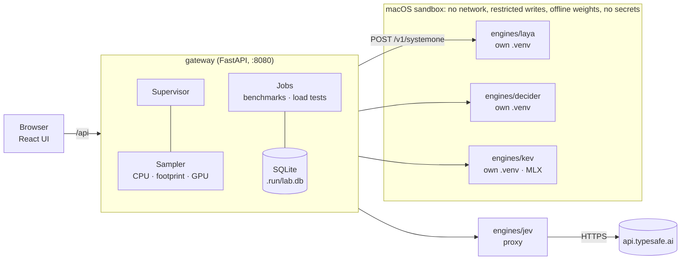

# Architecture



## One boundary

Every engine is an HTTP server that speaks TypeSafe's `/v1/systemone` wire format. None of them is written from
scratch: [`labkit`](../labkit/src/labkit) provides the server, and an engine only supplies a loader:

```python
def load(model: str, device: str, threads: int | None) -> Predictor: ...

class Predictor:
    def predict(self, state, questions) -> {"answers": {...}, "usage": {...}, "warnings": [...]}: ...
    def info(self) -> dict: ...
```

labkit does the rest:
1. It parses every request once into typed models (`contract.py`); invalid requests get a 422 with readable details.
2. It checks the engine's answers against the request and normalises them into one canonical shape. If an engine returns probabilities that don't sum to one, or labels that don't match, that's a **502 contract violation**, not a silently wrong chart.
3. It recomputes `confidence` from the probabilities with TypeSafe's published definition, because engines disagree on what confidence means. The engine's own value stays under `engine`.
4. It loads the model on a background thread, so the supervisor can time *process start → load → warm-up* separately. It runs one warm-up request, because the first MPS/MLX call compiles kernels.
5. It captures load-time warnings, such as a checkpoint shipping invalid calibration temperatures, and reports them in `/info`.
6. It runs inference on a single worker thread; queueing is part of what a load test measures.

`python -m labkit.conformance <url>` checks any running engine against the contract (12 checks); `make verify` runs it
for every engine inside the sandbox.

## Isolation

Docker on macOS can't reach the Apple GPU, and a VM big enough for a 4B model doesn't fit next to a normal
desktop. So each engine runs natively in its own uv virtualenv (dependency stacks never mix: Kev pins an older torch
than Laya), wrapped in `sandbox-exec` with a generated profile:

```scheme
(allow default)
(deny network-outbound)                                  ; no phoning home
(allow network-outbound (remote ip "localhost:*"))
(deny file-write*)
(allow file-write* (subpath "<engine project>") (subpath "~/.cache") (subpath ".run") (subpath "/private/tmp") …)
```

On top of the sandbox:
- The environment is rebuilt from scratch: `PATH`, `HOME`, `HF_HUB_OFFLINE=1`, and nothing else from your shell.
- Remote engines (Jev) skip the sandbox and receive only the variables their registry entry names in `secrets`.
- Engines watch their parent and exit if the gateway disappears, even on `SIGKILL`.
- On start, the gateway kills any engines a crashed predecessor left behind.

The tests check all of this: the network probe engine reports `blocked`, secrets never appear in an engine's environment,
and a killed gateway takes its engines with it.

## Measurement

See [metrics.md](metrics.md) for what every number means and how it's taken.

## Storage

`.run/` holds everything the playground creates: `lab.db` (runs, cold starts, peak memory per engine), `logs/`, sandbox
profiles and scratch space. Delete it to start fresh. Demos in the Playground live in your browser's localStorage.

## UI

React, TypeScript, Recharts and CodeMirror, built by Vite into `ui/dist` and served by the gateway. It polls the API:
- engine state every 1.5 s;
- metrics every 1 s (incrementally, only new samples);
- a running job every 0.7 s.

There's no client-side router library; routes are hash fragments (`#/bench`).
